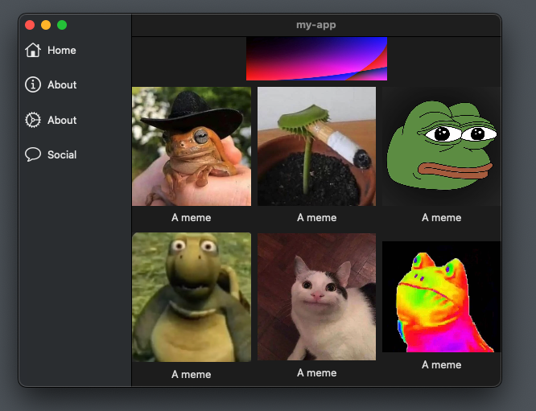

#  Build macOS App

Following tutorial: [SwiftUI: Build macOS App (2022, Xcode 12, SwiftUI 2) - macOS Development for Beginners](https://youtu.be/6Qa-SspgRMM)

## 01. Initialising an App

Open XCode and create amacOS app.

`my-app/ContentView.swift` will be the main part of your app.

```swift
import SwiftUI

struct ContentView: View {
    var body: some View {
        VStack {
            Image(systemName: "globe")
                .imageScale(.large)
                .foregroundColor(.accentColor)
            Text("Hello, world!")
        }
        .padding()
    }
}

struct ContentView_Previews: PreviewProvider {
    static var previews: some View {
        ContentView()
    }
}
```


## 02. Layout & Navigation

To add navigration we will add a `NavigationView` and add a list sidebar and main area.

```swift
import SwiftUI

struct ContentView: View {
    var body: some View {
        NavigationView {
            ListView()
            MainView()
        }
        .frame(minWidth: 600, minHeight: 400)
    }
}

struct ListView: View {
    var body: some View {
        Text("List")
    }
}

struct MainView: View {
    var body: some View {
        Text("Main")
    }
}

struct ContentView_Previews: PreviewProvider {
    static var previews: some View {
        ContentView()
    }
}
```


## 03. Sidebar

We will also pass a list of options into the `ListView` containing information for sidebar buttons.

We will create a hashable struct.

```swift
struct Option: Hashable {
    let title : String
    let imageName: String
}
```

Create an array of `Option` objects in the `ContentView` component, and pass it into `ListView`.

```swift
let options: [Option] = [
    .init(title: "Home", imageName: "house"),
    .init(title: "About", imageName: "info.circle"),
    .init(title: "About", imageName: "gear"),
    .init(title: "Social", imageName: "message")
]
// ...
ListView(options: options)
```

And update the `ListView` so it has an options array attribute,
and shows a stack of rows for the sidebar.

```swift
struct ListView: View {
    let options: [Option]
    var body: some View {
        VStack{              // Vertical stack
            ForEach(options, id: \.self) { option in
                HStack() {        // Horizontal stack
                    Image(systemName: option.imageName)
                        .resizable()
                        .aspectRatio(contentMode: .fit)
                        .frame(width: 20)
                    Text(option.title)
                    Spacer()
                }
                    .padding(8)
            }
            Spacer()        // Align stack to top (instead of being centered)
        }
    }
}
```


## 04. Main View

We need to add some image assets into our XCode project.

Open `Assets.xcassets`. Click and drag your images over.

The filename (minus the file 1extension) will be used to reference the image.

Now we will create a `MainView`.

```swift
struct MainView: View {
    let cols: [GridItem] = [
        .init(.flexible()),
        .init(.flexible()),
        .init(.flexible())
    ]
    let images = [
        "frog",
        "rough_day_huh",
        "pepe",
        "turtle_guy",
        "polite_cat",
        "mlg_frog"
    ]
    var body: some View {
        VStack {
            // Header
            Image("header")
                .resizable()
                .aspectRatio(contentMode: .fit)
            // Content
            LazyVGrid(columns: cols) {
                ForEach(images, id: \.self) { imageName in
                    VStack {
                        Image(imageName).resizable().aspectRatio(contentMode: .fit)
                        Text("A meme")
                    }
                }
            }
            Spacer()
        }
    }
}
```



The responsiveness of the main view is currently a bit scuffed.

## 05. Selected Sidebar Tab

Add a state to `ContentView`, which indicates the tab number selected.

```swift
struct ContentView: View {
    @State var currentOption = 0
    // ...
```

Add a binding to `ListView`.

```swift
struct ListView: View {
    let options: [Option]
    @Binding var currentSelection: Int
    // ...
```

(A binding create a two-way connection between a property and a view tat displays and changes data)

Pass in the binding variable in `ContentView`.

```swift
struct ContentView: View {
    // ...
            ListView(
                options: options,
                currentSelection: $currentOption
            )
    // ...
```

Create a switch statement in `ContentView` for `MainView`.

```swift
switch currentOption {
    case 0:
        MainView()
    case 1:
        Text("About View")
    case 2:
        Text("Settings View")
    case 3:
        Text("Social View")
    default:
        Text("Err View")
}
```

Add item coloring based on the current option (tab) selected in `ListView`.

```swift
struct ListView: View {
    let options: [Option]
    @Binding var currentSelection: Int

    var body: some View {
        VStack{
            let current = options[currentSelection] // <-- get the current option
            ForEach(Array(options.enumerated()), id: \.1) { index, option in // <-- changed to enumerated to get array index, and use element 1 as the id
                HStack() {
                    // Tab Icon
                    Image(systemName: option.imageName)
                        .resizable()
                        .aspectRatio(contentMode: .fit)
                        .frame(width: 20)
                    // Tab Label
                    Text(option.title)
                        .foregroundColor(current == option ? Color(.linkColor) : Color(.labelColor)) // <-- change the text color based on which option is selected
                        // Alt: currentSelection == index
                    // Bottom Spacer
                    Spacer()
                }
                    .padding(8)
                    .onTapGesture {
                        self.currentSelection = index // <-- change the current selected option on click
                    }
            }
            Spacer()
        }
    }
}
```

Note: These tabs are poorly made. They need to be made propper size, and fill