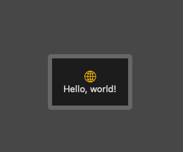
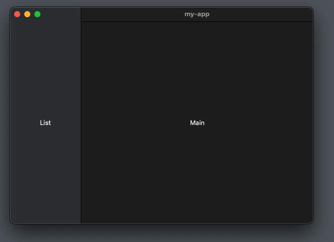
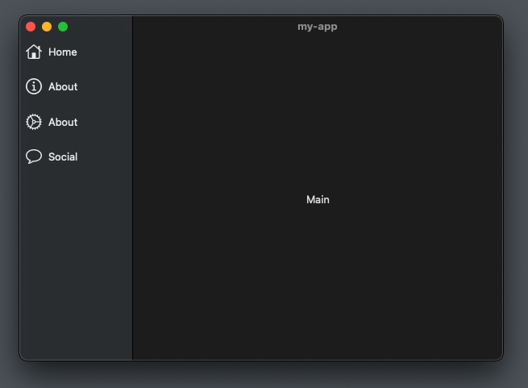

#  Build macOS App

Following tutorial: [SwiftUI: Build macOS App (2022, Xcode 12, SwiftUI 2) - macOS Development for Beginners](https://youtu.be/6Qa-SspgRMM)

## 01. Initialising an App

Open XCode and create amacOS app.

`my-app/ContentView.swift` will be the main part of your app.

```swift
import SwiftUI

struct ContentView: View {
    var body: some View {
        VStack {
            Image(systemName: "globe")
                .imageScale(.large)
                .foregroundColor(.accentColor)
            Text("Hello, world!")
        }
        .padding()
    }
}

struct ContentView_Previews: PreviewProvider {
    static var previews: some View {
        ContentView()
    }
}
```


## 02. Layout & Navigation

To add navigration we will add a `NavigationView` and add a list sidebar and main area.

```swift
import SwiftUI

struct ContentView: View {
    var body: some View {
        NavigationView {
            ListView()
            MainView()
        }
        .frame(minWidth: 600, minHeight: 400)
    }
}

struct ListView: View {
    var body: some View {
        Text("List")
    }
}

struct MainView: View {
    var body: some View {
        Text("Main")
    }
}

struct ContentView_Previews: PreviewProvider {
    static var previews: some View {
        ContentView()
    }
}
```


## 03. Sidebar

We will also pass a list of options into the `ListView` containing information for sidebar buttons.

We will create a hashable struct.

```swift
struct Option: Hashable {
    let title : String
    let imageName: String
}
```

Create an array of `Option` objects in the `ContentView` component, and pass it into `ListView`.

```swift
let options: [Option] = [
    .init(title: "Home", imageName: "house"),
    .init(title: "About", imageName: "info.circle"),
    .init(title: "About", imageName: "gear"),
    .init(title: "Social", imageName: "message")
]
// ...
ListView(options: options)
```

And update the `ListView` so it has an options array attribute,
and shows a stack of rows for the sidebar.

```swift
struct ListView: View {
    let options: [Option]
    var body: some View {
        VStack{              // Vertical stack
            ForEach(options, id: \.self) { option in
                HStack() {        // Horizontal stack
                    Image(systemName: option.imageName)
                        .resizable()
                        .aspectRatio(contentMode: .fit)
                        .frame(width: 20)
                    Text(option.title)
                    Spacer()
                }
                    .padding(8)
            }
            Spacer()        // Align stack to top (instead of being centered)
        }
    }
}
```

