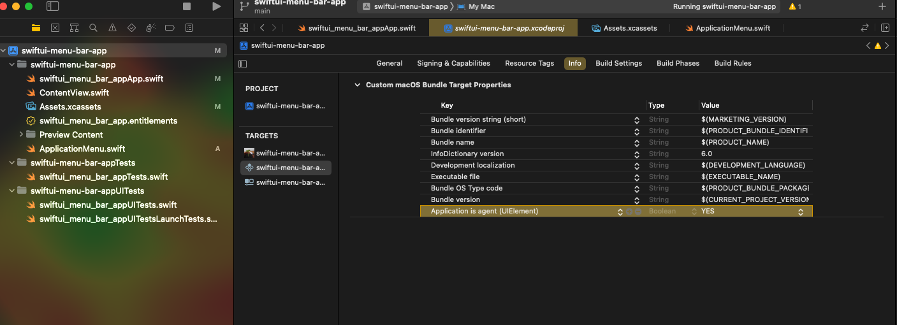
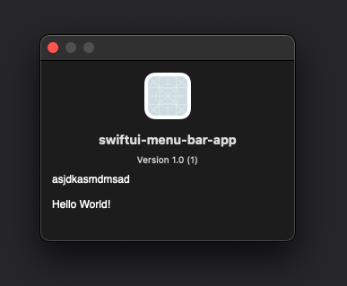

# Menu bar app in SwiftUI

Following:
* [Building a macOS Menu Bar App - The Dad Jokes Series (Part 1)](https://www.youtube.com/watch?v=CuMLpnjPr2Y)
* [Kyan Bar - demo SwiftUI status bar app](https://github.com/kyan/kyan_bar)

## 01. Create application menu tray

We need to create a `ApplicationMenu` class which implements `NSObject`.

```swift
//
//  ApplicationMenu.swift
//  swiftui-menu-bar-app
//
//  Created by Mark Connelly on 25/9/2022.
//

import Foundation
import SwiftUI

class ApplicationMenu: NSObject {
    let menu = NSMenu()

    func createMenu() -> NSMenu  {
        // The content of the menu bar
        let contentView = ContentView()

        // The menu bar hosting object
        let topView = NSHostingController(rootView: contentView)
        topView.view.frame.size = CGSize(width: 225, height: 225)

        // The menu bar items
        let customMenuItem = NSMenuItem()
        customMenuItem.view = topView.view
        menu.addItem(customMenuItem)
        menu.addItem(NSMenuItem.separator())
        return menu
    }
}
```

## 02. Create AppDelegate and menu icon

We need to create an `AppDelegate` class in the main application entroy point.

```swift
//
//  swiftui_menu_bar_appApp.swift
//  swiftui-menu-bar-app
//
//  Created by Mark Connelly on 25/9/2022.
//

import SwiftUI

@main
struct swiftui_menu_bar_appApp: App {
    @NSApplicationDelegateAdaptor(AppDelegate.self) var appDelegate // 2. Add to main app
    var body: some Scene {
        Settings {  // 3. Remove the window view
            EmptyView()
        }
    }
}

// 1. Create AppDelegate class
class AppDelegate: NSObject, NSApplicationDelegate {
    static private(set) var instance: AppDelegate!
    lazy var statusBarItem = NSStatusBar.system.statusItem(withLength: NSStatusItem.variableLength)
    let menu = ApplicationMenu()

    func applicationDidFinishLaunching(_ notification: Notification) {
        AppDelegate.instance = self
        statusBarItem.button?.image = NSImage(named: NSImage.Name("kyan-logo"))
        statusBarItem.button?.imagePosition = .imageLeading
        statusBarItem.menu = menu.createMenu()
    }
}
```

Also we need to remove the application icon that shows in the dock.

## 03. Hide application dock icon

Go to the app settings > info. Click plus sign to add a row. Set `Application is agent (UIElement)` to `YES`.



But it does not appear to be working.

## 04. Add about page

Create a `Credits.rtf` rich text file.

We can create an about function and menu item for about.

```swift
//  ApplicationMenu.swift
// ...
        // About button
        let aboutMenuItem = NSMenuItem(title: "About this app", action: #selector(about), keyEquivalent: "")
        aboutMenuItem.target = self
        menu.addItem(aboutMenuItem)
// ...
    @objc func about(sender: NSMenuItem) {
        NSApp.orderFrontStandardAboutPanel()
    }
// ...
```



## 05. Add open weblink button

Similar to about page.

```swift
// ...
        // Link button
        let linkMenuItem = NSMenuItem(title: "Go to website", action: #selector(openLink), keyEquivalent: "")
        linkMenuItem.target = self
        menu.addItem(linkMenuItem)
        linkMenuItem.representedObject = "https://github.com/plasmatech8/swift-practice"
// ...
    @objc func openLink(sender: NSMenuItem) {
        let link = sender.representedObject as! String
        guard let url = URL(string: link) else {return}
        NSWorkspace.shared.open(url)
    }
```

## 06. Add quit button

Similar to about page as well. Notice that we adda command key shortcut `q`.

```swift
// ...
        // Quit button
        let quitMenuItem = NSMenuItem(title: "Quit", action: #selector(quit), keyEquivalent: "q")
        quitMenuItem.target = self
        menu.addItem(quitMenuItem)
// ...
    @objc func quit(sender: NSMenuItem) {
        NSApp.terminate(self)
    }
```

## 07. Notarising

To share your app with others, you need an Apple developer account.

`Product > Archive`

After distributing, you will get an email from Apple.
